

    <h1>🏥 Hospital Management System</h1>
    
<strong>A web application to manage hospital operations efficiently for users, doctors, and administrators.</strong>

<h2>📖 Project Features</h2>

<i>⚙️</i> Built with <strong>Spring MVC, Spring JPA, and Spring Boot</strong>.

<i>🎨</i> Frontend designed using <strong>HTML, CSS, JavaScript, and Bootstrap</strong>.

<i>💾</i> Database powered by <strong>MySQL</strong>.

<i>🔒</i> Role-based access for <strong>Users, Doctors, and Admins</strong>.

<h2>👤 User Functionalities</h2>

<i>📅</i> Add appointments.

<i>🧾</i> View patient details.

<i>🔑</i> Change their password.

<h2>🔑 Admin Functionalities</h2>

<i>➕</i> Add, <i>✏️</i> Edit, <i>👁️</i> View, and <i>❌</i> Remove doctors.

<i>➕</i> Add specialists.

<i>📋</i> View patient details.

<i>📊</i> View overall statistics (doctors, appointments, specialists, users).

<h2>🩺 Doctor Functionalities</h2>

<i>👁️</i> View patient details.

<i>✏️</i> Edit their profile.

<i>💊</i> Provide prescriptions.

<i>📊</i> View counts of doctors and patients.

<h2>📸 Project Screenshots</h2>

Below are some attractive screenshots of the application:

<!-- Image Gallery -->

    <h3>🏠 Index Page</h3>
    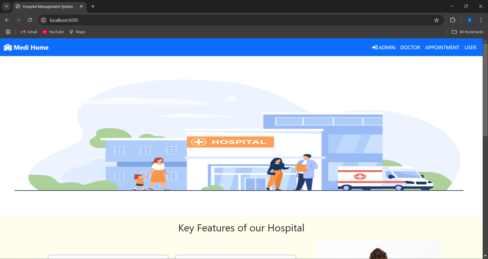

    <h3>🔑 User Login Page</h3>
    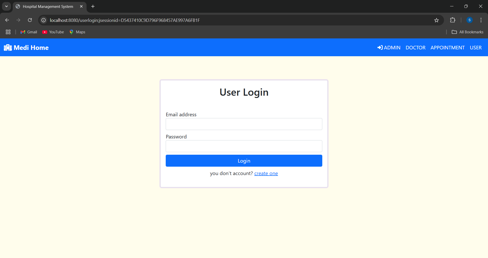

    <h3>📝 User Registration Page</h3>
    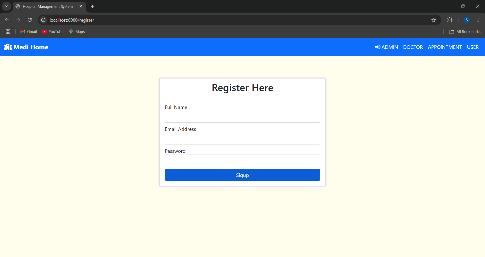

    <h3>👤 User Home Page</h3>
    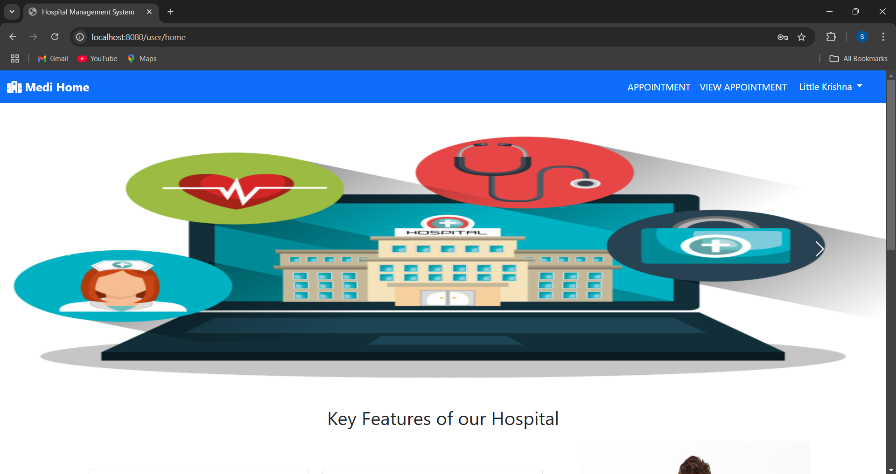

    <h3>📅 Appointment Page</h3>
    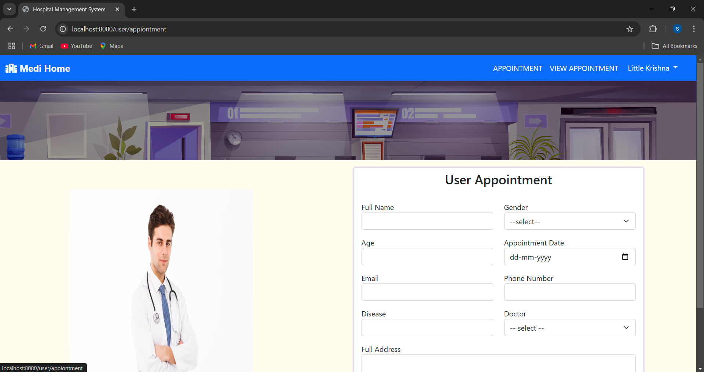

    <h3>📋 Appointment List Page</h3>
    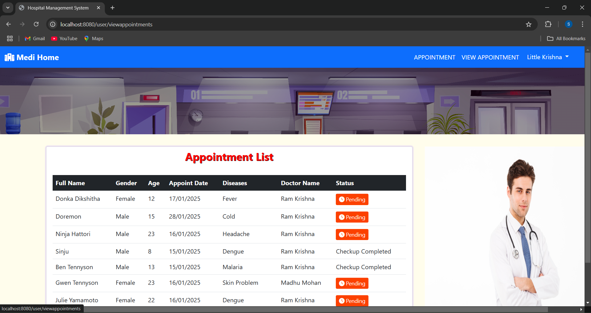

    <h3>🔑 Change Password Page</h3>
    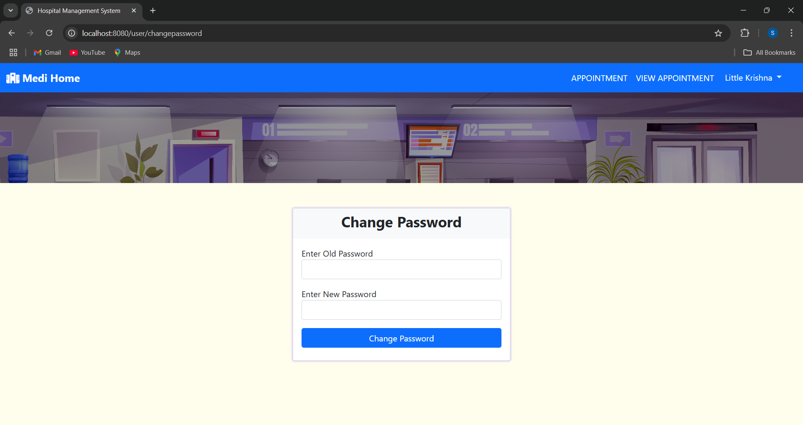

    <h3>🚪 User Logout Page</h3>
    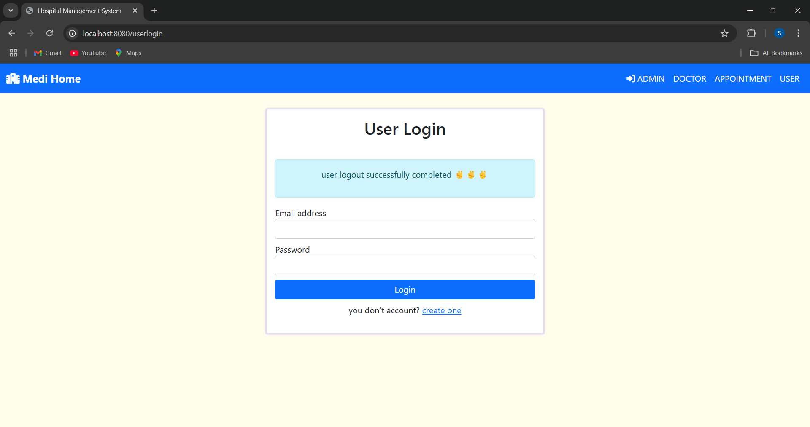

    <h3>👨‍⚖️ Admin Login Page</h3>
    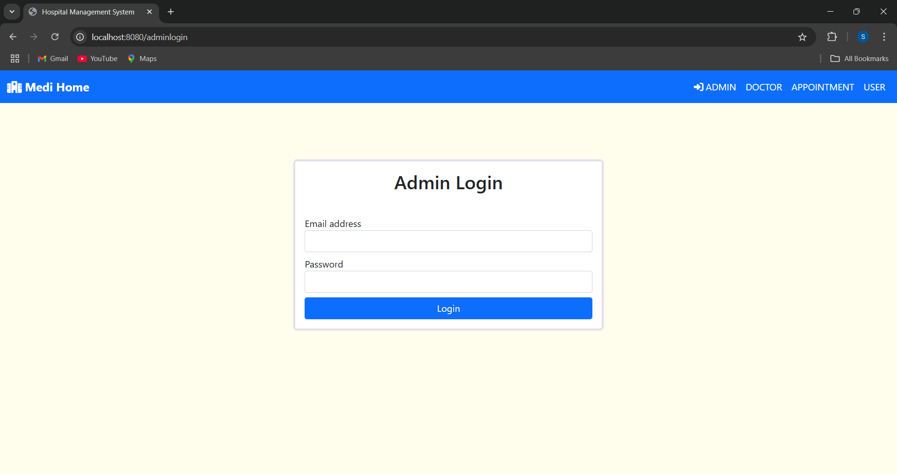

    <h3>🏠 Admin Home Page</h3>
    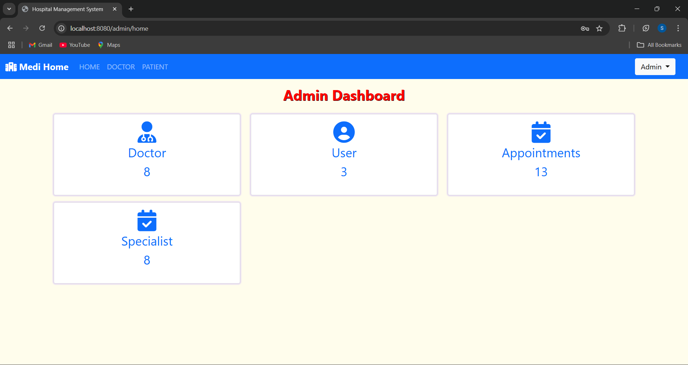

    <h3>🩺 Admin Doctor Dashboard</h3>
    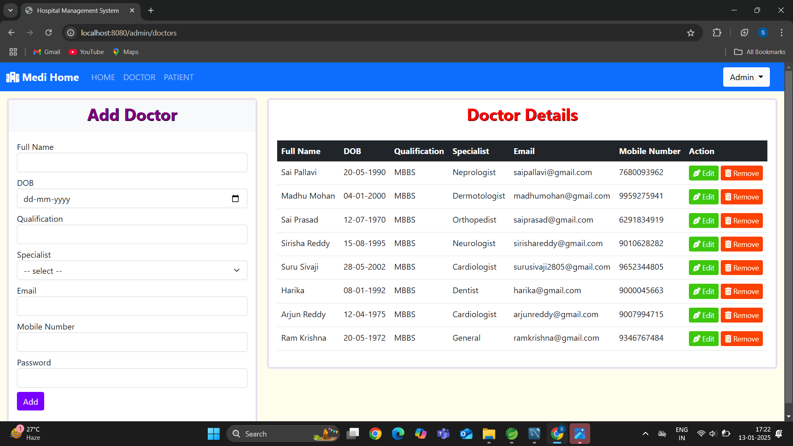

    <h3>🖊️ Update Doctor Information</h3>
    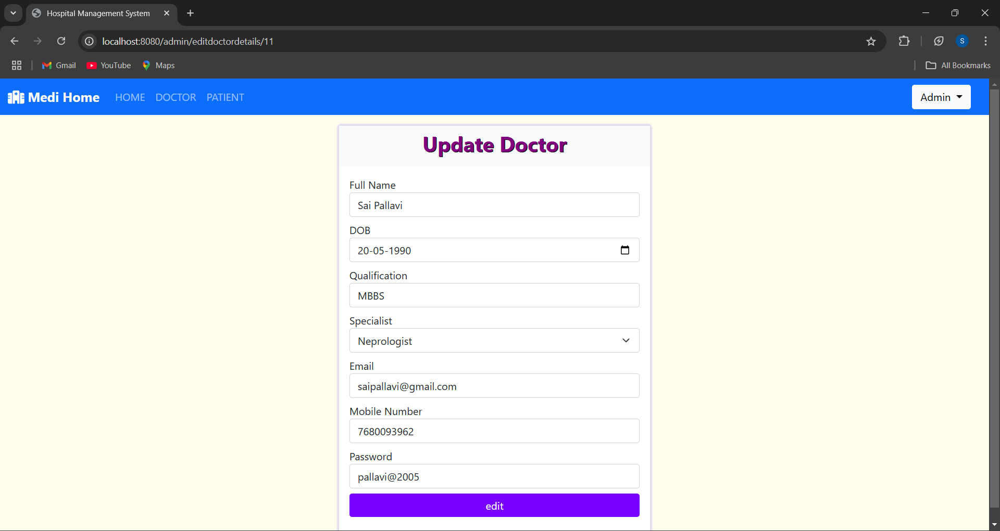

    <h3>❌ Remove Doctor Page</h3>
    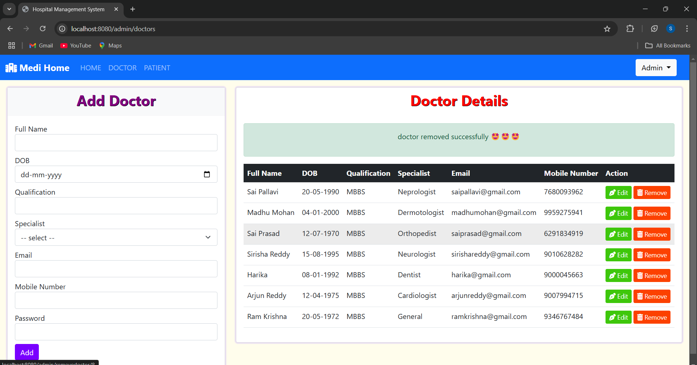

    <h3>👩‍⚕️ Doctor Page</h3>
    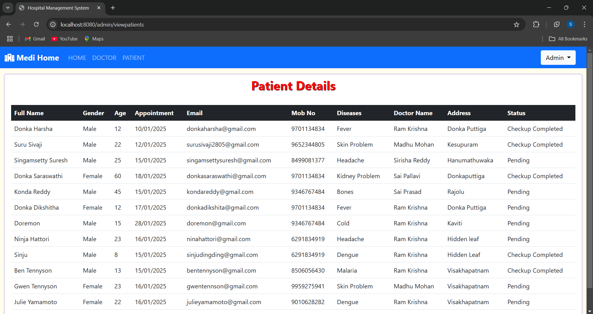

    <h3>🚪 Admin Logout Page</h3>
    

    <h3>👨‍⚕️ Doctor Login Page</h3>
    

    <h3>🏠 Doctor Home Page</h3>
    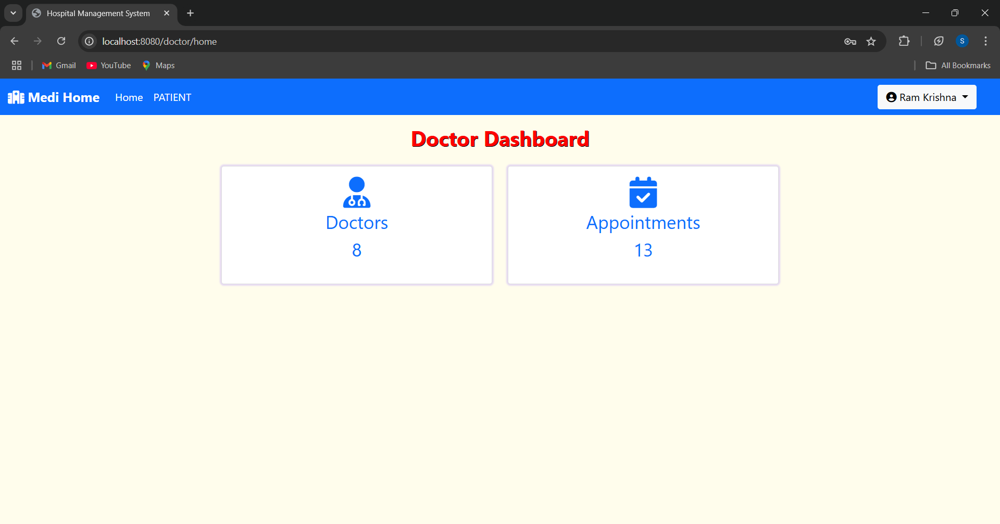

    <h3>👩‍⚕️ Patient Details Page</h3>
    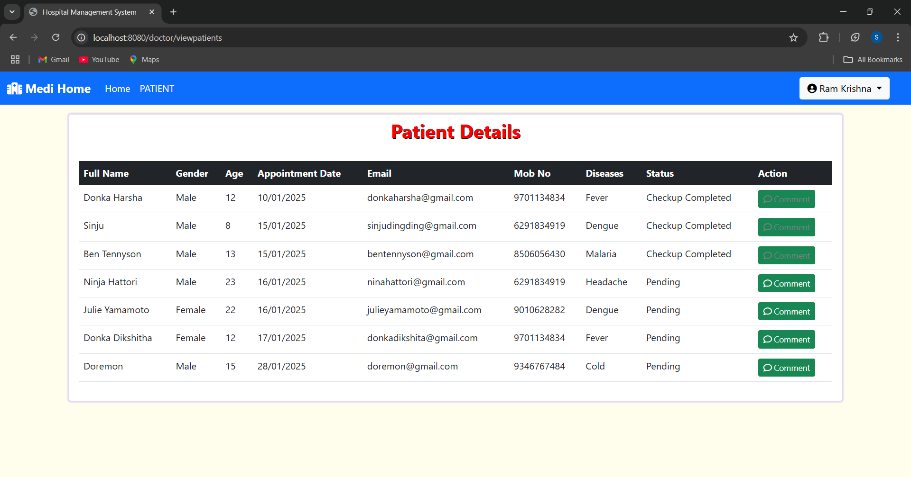

    <h3>📝 Doctor Comment Page</h3>
    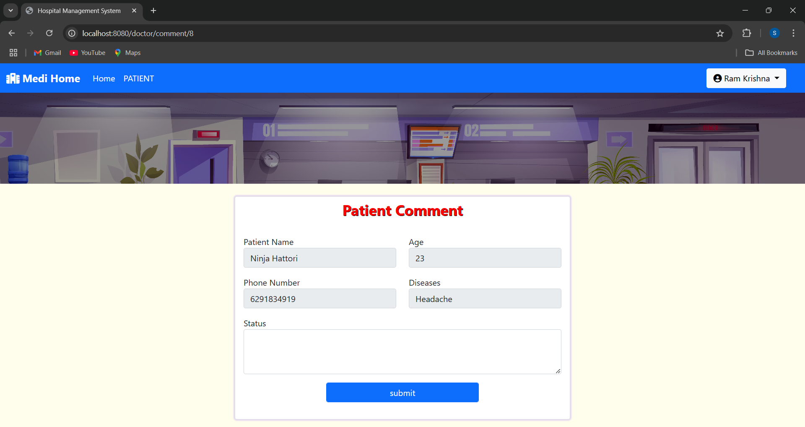

    <h3>🚪 Doctor Logout Page</h3>
    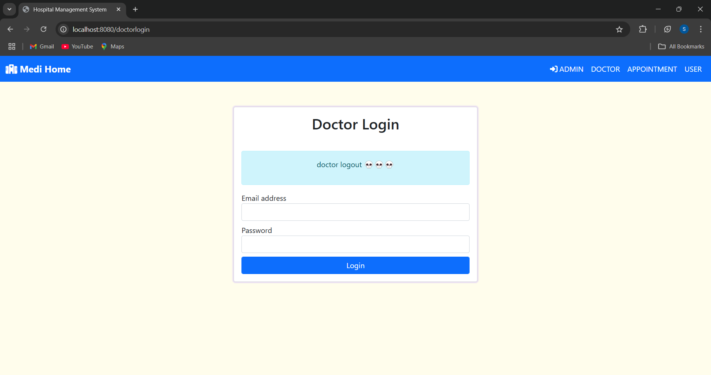

<h2>🚀 Getting Started</h2>

<h3>🛠️ Prerequisites</h3>

<i>☕</i> Java 8 or above

<i>⚙️</i> Spring Boot

<i>💾</i> MySQL

<i>🔧</i> Maven

<h3>⚡ Steps to Run</h3>
<ol>
    <li>Clone the repository:
        <pre><code>git clone https://github.com/yourusername/hospital-management-system.git</code></pre>
    </li>
    <li>Navigate to the project directory:
        <pre><code>cd hospital-management-system</code></pre>
    </li>
    <li>Configure the database in <code>application.properties</code>:
        <pre><code>
spring.datasource.url=jdbc:mysql://localhost:3306/hospital_db
spring.datasource.username=your_username
spring.datasource.password=your_password
        </code></pre>
    </li>
    <li>Run the application:
        <pre><code>mvn spring-boot:run</code></pre>
    </li>
    <li>Open your browser and navigate to:
        <pre><code>http://localhost:8080</code></pre>
    </li>
</ol>

<h2>📊 Statistics</h2>

<i>👨‍⚕️</i> Total Doctors

<i>📅</i> Total Appointments

<i>💼</i> Total Specialists

<i>👥</i> Total Users

<h2>🔍 How It Works</h2>

The Hospital Management System operates seamlessly to handle various roles and their respective functionalities. Here's how it works:

<h3>For Users</h3>
<ol>
    <li><strong>Registration:</strong> New users register with their details to access the system.</li>
    <li><strong>Login:</strong> Users log in with their credentials.</li>
    <li><strong>Book Appointments:</strong> Users can schedule appointments with available doctors.</li>
    <li><strong>View Details:</strong> Users can view their appointment history and other relevant data.</li>
    <li><strong>Change Password:</strong> Users can update their passwords securely.</li>
</ol>

<h3>For Doctors</h3>
<ol>
    <li><strong>Login:</strong> Doctors log in to access their profiles.</li>
    <li><strong>View Patients:</strong> Doctors can view the details of patients assigned to them.</li>
    <li><strong>Prescriptions:</strong> Doctors can provide and update prescriptions for patients.</li>
    <li><strong>Manage Profile:</strong> Doctors can update their profile details if needed.</li>
</ol>

<h3>For Admins</h3>
<ol>
    <li><strong>Login:</strong> Admins log in with their credentials.</li>
    <li><strong>Manage Doctors:</strong> Admins can add, edit, view, and remove doctors from the system.</li>
    <li><strong>Manage Specialists:</strong> Admins can add or edit specialist categories.</li>
    <li><strong>View Statistics:</strong> Admins have access to a dashboard showing overall hospital statistics.</li>
</ol>

    <h2>🎉 Thank You for Using the Hospital Management System!</h2>
    
We hope this application helps streamline your experience, whether you're a user scheduling appointments, a doctor managing patients, or an administrator overseeing the operations.

    
  
        <h3><i>💖</i>Stay Safe, Stay Healthy!<i>💖</i></h3>  
    

